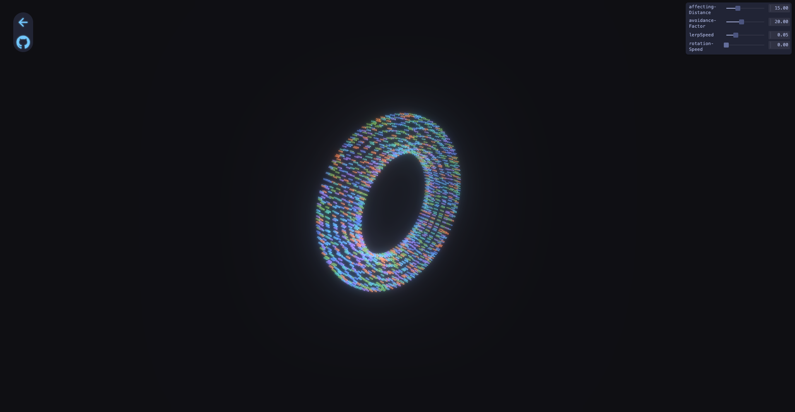

# Particle Avoidance Simulator

This is a simple particle simulator for various objects including spheres and cubes where the particles avoid the mouse based on certain parameters. Built with Svelte and Three.js.

